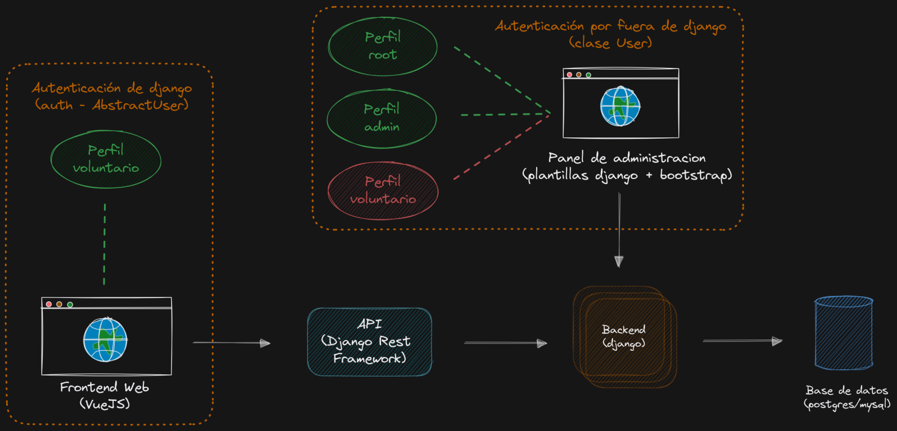

# Plataforma Rayuela

Esta plataforma propone un abordaje para incorporar ludificación adaptativa a proyectos de ciencia ciudadana

## Tecnologías - Versiones

### Base de datos

- **Postgres** o **mysql**

### Backend/Backoffice

- **Django** *v4.1.1* con **Python** *v3.8*

### API

- **Django Rest Framework** *v3.14.0*

### Frontend Web

- **VueJS** *3\.3.4* con **npm** *v18.17.1*



## Pre-requisitos

* Se recomienda tener instalado [nvm](https://github.com/nvm-sh/nvm) para manejar diferentes versiones de node
* Es necesario tener instalado y funcionando el [backend](https://github.com/cientopolis/rayuela) de la plataforma

## Instalación del entorno

#### Instalación de node

Versión Node (LTS): **v18.17.1**
```
nvm install 18.17.1
```
**NOTA:** última versión LTS hasta el momento de iniciado el proyecto

#### Instalación de VUE
Versión Vue: **3.3.4**

Clonamos el repositorio
```
git clone https://github.com/cientopolis/rayuela-frontend/
```

Ingresamos a la carpeta del proyecto
```
cd rayuela-frontend
```

Cambiamos a la versión de node del archivo _.nvmrc_ 
```
nvm use 
```

Instalamos paquetes y dependencias npm
```
npm install
```

#### Variables de entorno

1. Copiar el archivo _env.example_ y llamarlo **.env** (o **.env.production** en producción)
2. Completar las variables dentro del archivo con los datos para trabajar en local o producción
3. Para hacer uso de este archivo de configuración en el código, usar ```import.meta.env.<CLAVE>```. Ej: ```import.meta.env.VITE_ROOT_API```

## Despliegue de la aplicación
```
npm run dev
```
**NOTA:** Comprobamos que funciona en la URL que nos devuelve la consola: http://localhost:5173/

## Internacionalización
Trabajar con archivos de idioma _.json_ en la carpeta _src/locales_.

El formato es ```"VARIABLE": "traducción"```

También se pueden agrupar tipos o secciones de traducción. Por ejemplo:
```
{
    "grupo": {
        "var_1": "Traducción var_1",
        "var_2": "Traducción var_2"
    },
    
    "home": "Inicio",
    "about": "Acerca de",
}
```

## Ejecución de los tests


## Créditos

* **Sergio** - [tarbz2](https://github.com/tarbz2).

## License

Rayuela is a free software and content project:

- The source code is licensed under the **GNU General Public License v3.0 or later (GPLv3+)**. See the [LICENSE](LICENSE) file for details.
- The site content is licensed under the **Creative Commons Attribution-NonCommercial-ShareAlike 4.0 International (CC BY-NC-SA 4.0)**. See the [CONTENT-LICENSE.md](CONTENT-LICENSE.md) file for details.